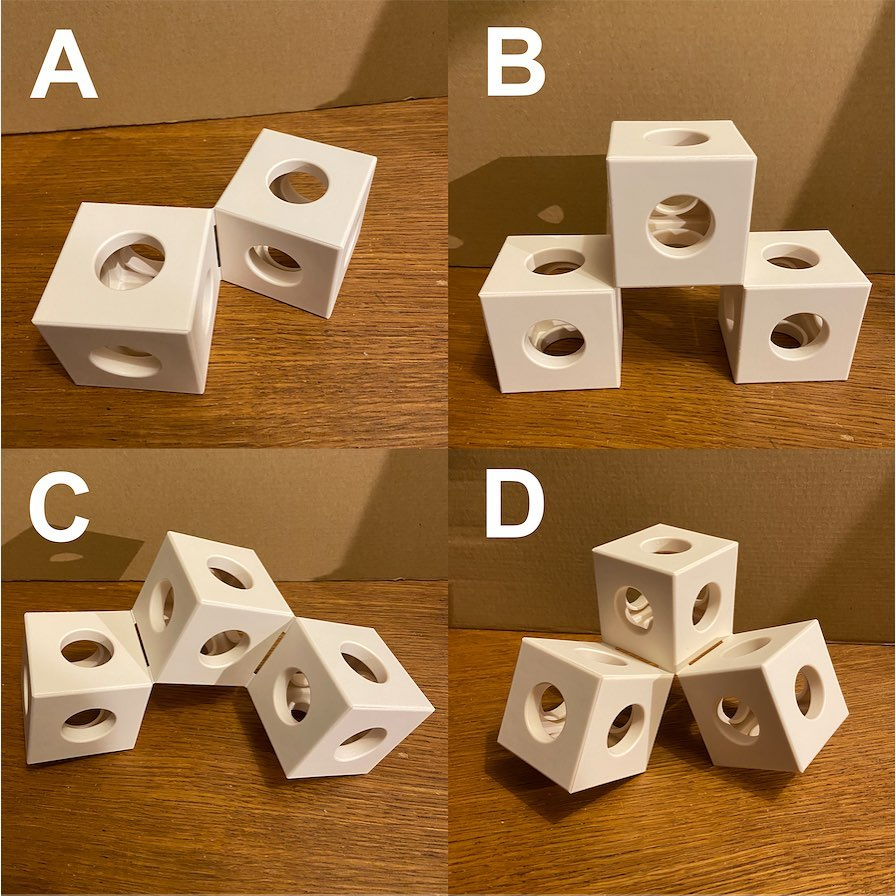
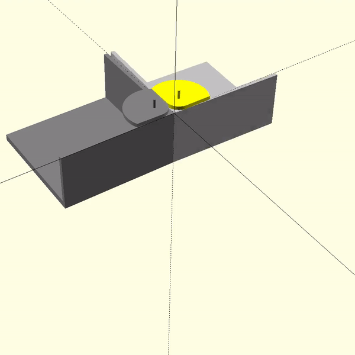

# Shape-shifting cube

## Idea

Cubes that can locomote, or at least reconfigure a bit. I don't need them to
connect or disconnect, but it would be nice to get two hinges per cube at
least.

I'd like to use normal 90g servos or something as similarly commodity.

I'd also like the outside surface to be almost perfect when not in motion - no
protruding motors etc. 

## Inspiration

https://www.youtube.com/watch?v=opGOs7Zxeas which was inspired by
https://www.youtube.com/erikabergworks (see also
https://www.instagram.com/erik_aberg_works/).

Source: https://www.instagram.com/p/CMxrGzos_UX/

## Current approach

Motorised cams that can push out of the side, each by 90°, against a matching
cam on the adjacent box.

No idea of the approach to doing the hinge, but I may use magnets to hold in
place at ends of motion.

## Model

magicbox.scad is the assembled idea, at the moment.

## Motion study of the cams, in OpenSCAD

## Algorithm for separation angle between boxes based on cam rotation

r = cam inner radius
c = cam outer radius
d = cam rotation from zero

### Wolfram Alpha

All angles need conversion to radians

    a = 2 * tan^(-1)((c * sin(90 - cos^(-1)(r/c) + d) - r) / (r + sqrt(c^2-(c * sin(90 - cos^(-1)(r/c) + d))^2)))

### OpenSCAD

Takes into account the whole turn:

    function separation_angle(d, r, c) =
        d < acos(r/c) ?
            -2 * atan((c * sin(90 - acos(r/c) + d) - r) / (r + sqrt(pow(c,2)- pow(c * sin(90 - acos(r/c) + d), 2))))
            :
            -2 * atan((c * sin(90 - acos(r/c) + d) - r) / (r - sqrt(pow(c,2)- pow(c * sin(90 - acos(r/c) + d), 2))));
