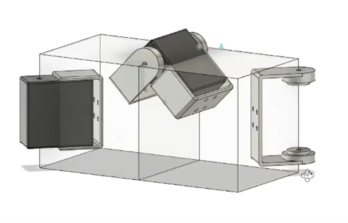
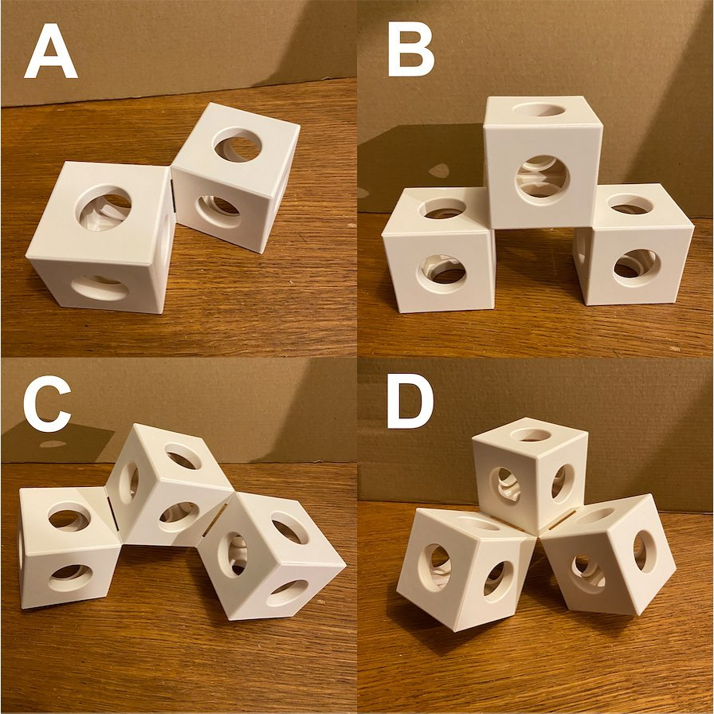
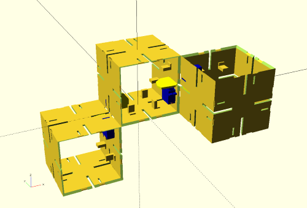

# Shape-shifting cubes

## Idea

Cubes that can locomote, or at least reconfigure a bit. I don't need them to
connect or disconnect, but it would be nice to get two hinges per cube at
least.

I'd like to use normal 9g servos or something as similarly commodity.

I'd also like the outside surface to be almost perfect when not in motion - no
protruding motors etc.

I really want the design to avoid this sort of protrusion at the hinge:



[source](https://youtu.be/opGOs7Zxeas?t=76)

## Inspiration

[Erik Aberg's GHOSTKUBE](https://www.youtube.com/erikabergworks) (see also his
[Instagram](https://www.instagram.com/erik_aberg_works/)) which I cam across
via [James Bruton's video](https://www.youtube.com/watch?v=opGOs7Zxeas).

## Current approach

Motorised cams that can push out of the side, each by 90°, against a matching
cam on the adjacent box. Because the pushing is against sides already
connected, it's as close to maintaining the purity of the cubes as I can get.

Likely to use some sort of flexible material as the hinge, and magnets to hold
in place at ends of motion. Magnets will also help relieve force needed at end
of movement.

The aim is to implement the four configurations that Erik did, which
apparently covers every model he's made.



Source: https://www.instagram.com/p/CMxrGzos_UX/

This is how configuration c currently looks using two panel types I'm working
with, using a 100mm cube (I think I can go smaller):



## Model

`magicbox.scad` has all the parts themselves.

`configuration-*.scad` maps to the configurations shown above.

## Motion study of the cams, in OpenSCAD


## Algorithm for separation angle between boxes based on cam rotation

r = cam inner radius
c = cam outer radius
d = cam rotation from zero

### Wolfram Alpha

All angles need conversion to radians

    a = 2 * tan^(-1)((c * sin(90 - cos^(-1)(r/c) + d) - r) / (r + sqrt(c^2-(c * sin(90 - cos^(-1)(r/c) + d))^2)))

### OpenSCAD

Takes into account the whole turn:

```OpenSCAD
function separation_angle(d, r, c) =
    d < acos(r/c) ?
        -2 * atan((c * sin(90 - acos(r/c) + d) - r) / (r + sqrt(pow(c,2)- pow(c * sin(90 - acos(r/c) + d), 2))))
        :
        -2 * atan((c * sin(90 - acos(r/c) + d) - r) / (r - sqrt(pow(c,2)- pow(c * sin(90 - acos(r/c) + d), 2))));
```

### Python

```python
def box_angle_degrees(cam_angle_degrees, cam_inner_radius, cam_outer_radius):
    # Shorthand variables as per other implementations
    d = math.radians(cam_angle_degrees)
    r = float(cam_inner_radius)
    c = float(cam_outer_radius)

    if d < math.acos(r/c):
        return math.degrees(2 * math.atan((c * math.sin(math.radians(90) - math.acos(r/c) + d) - r) / (r + math.sqrt(pow(c, 2) - pow(c * math.sin(math.radians(90) - math.acos(r/c) + d), 2)))))
    else:
        return math.degrees(2 * math.atan((c * math.sin(math.radians(90) - math.acos(r/c) + d) - r) / (r - math.sqrt(pow(c, 2) - pow(c * math.sin(math.radians(90) - math.acos(r/c) + d), 2)))))
```
